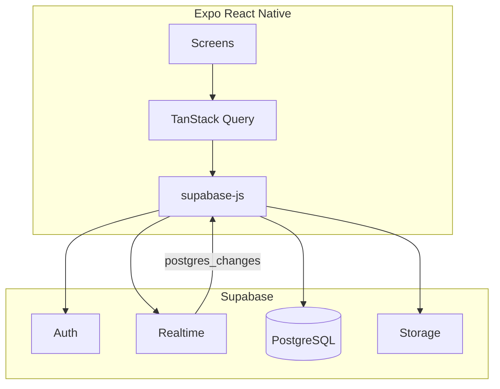

# SkillBee — architecture (Expo + Supabase)

The app is **Expo (React Native)** with **Supabase Auth**, **Postgres** (tables defined in `prisma/schema.prisma`), **Storage**, and **Realtime**. There is **no** in-repo Express server: TanStack Query hooks call **`@supabase/supabase-js`** via `lib/data/*`.

## 1. High-level diagram

**Rule:** the app **never** imports `@prisma/client`. Prisma is for **schema + CLI** (`db push` / migrate) only.

## 2. Main paths

| Path | Role |
|------|------|
| `app/` | Expo Router screens |
| `lib/supabase.ts` | Supabase client + AsyncStorage session |
| `lib/data/*` | Reads/writes to Postgres + Storage + RPCs |
| `lib/auth/supabaseSync.ts` | Upserts `public.users` / `profiles` after role pick |
| `hooks/useGigs.ts` | Open requirements feed |
| `hooks/usePlatformRealtime.ts` | Invalidates React Query on DB changes |
| `hooks/useInboxThreads.ts` / `useThreadMessages.ts` | Chat |
| `hooks/useDashboard.ts` | Aggregates from Supabase |
| `prisma/schema.prisma` | Schema source of truth |
| `supabase/sql/004_client_supabase_only.sql` | **RLS + triggers + RPCs** required by the client |

## 3. Data model (summary)

**User**, **Profile**, **Requirement**, **Application**, **Project**, **Message**, **Payment**, **Transaction**, **Notification**, **ActivityLog**.

- **User.id** = `auth.users.id`.
- **Requirement** = gig card in the UI.
- **Application** = student applies; **accept** runs Postgres RPC `accept_application` (creates **Project**, rejects other pending apps).
- **Payments / Razorpay**: checkout via WebView + Supabase Edge Functions `razorpay-create-order` / `razorpay-verify-payment` (see `docs/DEPLOYMENT.md`, `supabase/functions/README.md`).

## 4. Realtime

1. Add tables to `supabase_realtime` publication (`docs/supabase-rls-realtime.sql`).
2. `usePlatformRealtime` listens to `postgres_changes` and invalidates query keys.
3. `AuthSessionBridge` sets Realtime auth to the Supabase access token.

## 5. Authentication

- **Supabase Auth** + Google / email flows (`lib/auth/*`, `app/auth/*`).
- After the user picks **student** vs **client** on `app/role.tsx`, `syncBackendUser` upserts `public.users` (and profile row) so RLS role checks work.

## 6. Security

- Run **`004_client_supabase_only.sql`** so RLS and RPCs match what the app expects.
- **Never** put `SUPABASE_SERVICE_ROLE_KEY` or Razorpay secrets in `EXPO_PUBLIC_*` vars.

## 7. Deployment

See **`docs/DEPLOYMENT.md`** (EAS + Supabase env only).
